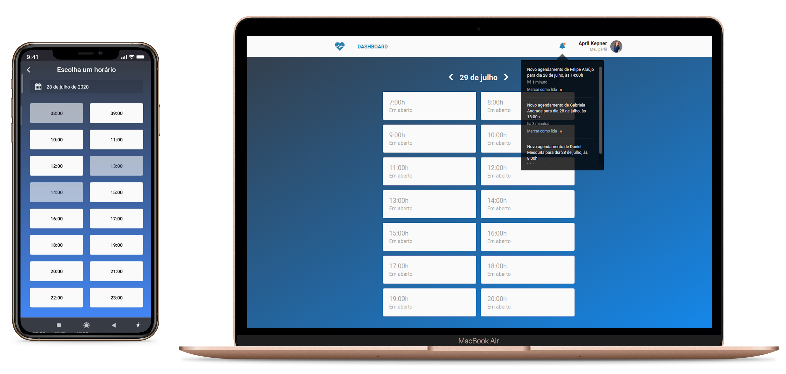

# DoctorTime 🤒 🕔

This project is divided in 3 parts, [REST API](#rest-api), [WEB](#web) and [MOBILE](#mobile). <br/><br/>
In the website doctors can sign up to offer their services, being able to see their schedules and manage them. In the mobile app, clients can schedule a consult with their favorite doctor. The rest api deals with all the data and logic, sending all requests and responses in real time with no need to reload any screen.

<br><br>

<br>

## REST API

### Technologies

- [Node.js](https://nodejs.org/)
- [Express](https://expressjs.com/)
- [Docker](https://www.docker.com/)
- [Postgres](https://www.postgresql.org/)
- [Sequelize](http://sequelize.org/)
- [MongoDB](https://www.mongodb.com/)
- [Multer](https://github.com/expressjs/multer)
- [Mongoose](https://mongoosejs.com/)
- [Redis](https://redis.io/)
- [Bee Queue](https://github.com/bee-queue/bee-queue)
- [Nodemailer](https://nodemailer.com/about/)
- [Handlebars](https://handlebarsjs.com/)
- [Date-fns](https://date-fns.org/)

## WEB

### Technologies

- [ReactJS](https://reactjs.org/)
- [React Router DOM](https://github.com/ReactTraining/react-router/tree/master/packages/react-router-dom)
- [React Icons](https://github.com/react-icons/react-icons)
- [Redux](https://redux.js.org/)
- [Redux Saga](https://redux-saga.js.org/)
- [Redux Persist](https://github.com/rt2zz/redux-persist)
- [Styled Components](https://styled-components.com/)
- [Axios](https://github.com/axios/axios)

## MOBILE

### Technologies

- [ReactJS](https://reactjs.org/)
- [React Native](https://reactnative.dev/)
- [React Navigation](https://reactnavigation.org/)
- [React Native Vector Icons](https://github.com/oblador/react-native-vector-icons)
- [Redux](https://redux.js.org/)
- [Redux Saga](https://redux-saga.js.org/)
- [Redux Persist](https://github.com/rt2zz/redux-persist)
- [Reactotron](https://github.com/infinitered/reactotron)
- [Styled Components](https://styled-components.com/)
- [Axios](https://github.com/axios/axios)

## GETTING STARTED

### Requirements

- [Node.js](https://nodejs.org/)
- [Yarn](https://yarnpkg.com/) or [npm](https://www.npmjs.com/)
- [git](https://git-scm.com/)
- [Docker](https://www.docker.com/)
- [React Native development environment](https://reactnative.dev/docs/environment-setup)

#### Clone the project and access the folder

```shell
$ git clone https://github.com/danielmesquitta/doctortime && cd doctortime
```

### Start backend

```shell
# Go to the correct folder
$ cd backend

# Install the dependencies
$ yarn

# Start
$ yarn start
```

### Start web

```shell
# Go to the correct folder
$ cd frontend

# Install the dependencies
$ yarn

# Start
$ yarn start
```

### Start mobile

```shell
# Go to the correct folder
$ cd mobile

# Install the dependencies
$ yarn

# Start
$ yarn android
```

